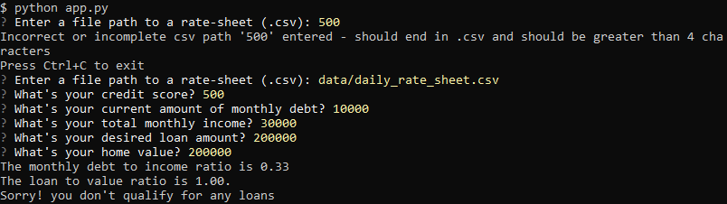
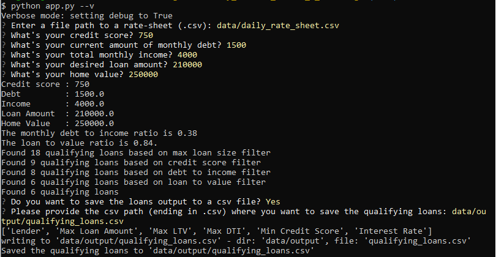
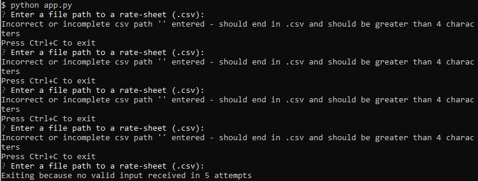
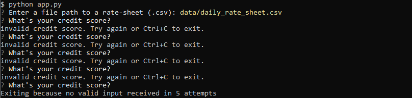

# Project Title

Determines home loan eligibility from a set of loans based on certain loan qualification criteria and 
saves the qualifying loans to a csv file based on user preference. 

This project determines which loans the user qualifies for from a list of loan providers based on the following loan qualification criteria:
    * Current Credit Score of the applicant
    * Loan Size requested by the applicant
    * Monthly Debt Payments of the applicant
    * Monthly Income of the applicant
    * Estimated Home Value for which loan is requested.

---

## Technologies

This project uses python 3.7 along with the following packages:

* [fire](https://github.com/google/python-fire) - For the command line interface.

* [questionary](https://github.com/tmbo/questionary) - For interactive user prompts.

* [pytest](https://docs.pytest.org/en/stable/) - For basic testing of the application.

other packages:

* csv, pathlib, os, sys

---

## Installation Guide

Please install the following before starting the application

```python
  pip install fire
  pip install questionary
  pip install pytest
```
In case of issues, please see the requirements.txt for a complete list of packages with versions needed to run this application

---

## Usage

To use the loan qualifier project, please download and run the **app.py** with:

```python
python app.py

python app.py --help
python app.py --h
```

For command line options:


When applicant qualifies for loans and saves the loans to a csv file:


When applicant qualifies for loans but does not save the loans to a csv file:


Failed to qualify for loans:


When the applicant qualifies and chooses verbose debug option:


Behavior when invalid file name is specified:


Behavior when invalid loan screening input is entered:


---

## Contributors

Sangram Singh (sangramsinghg@yahoo.com)

---

## License

MIT
